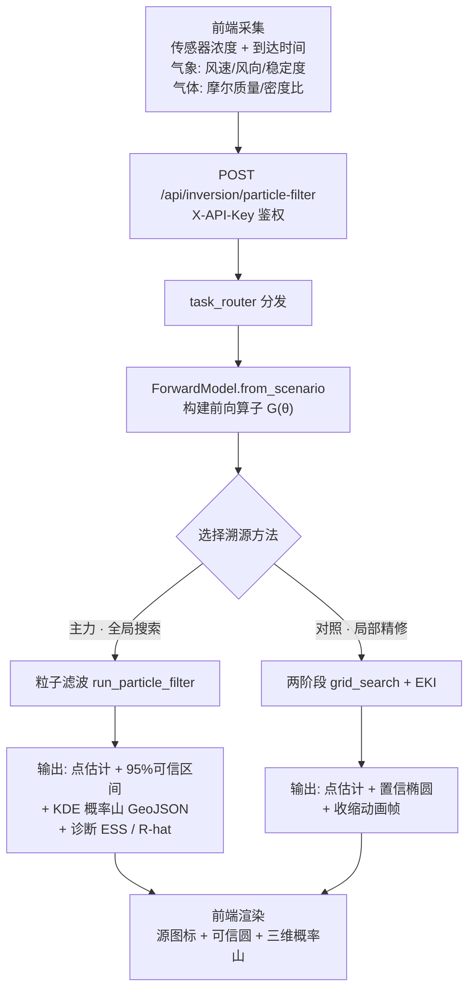
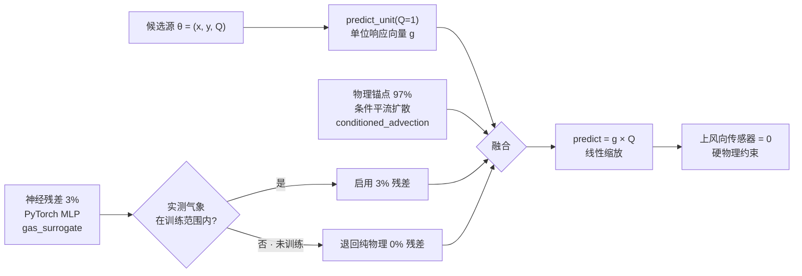
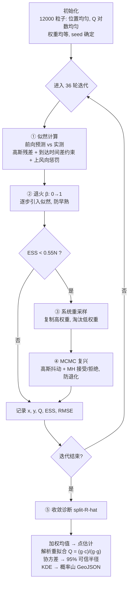
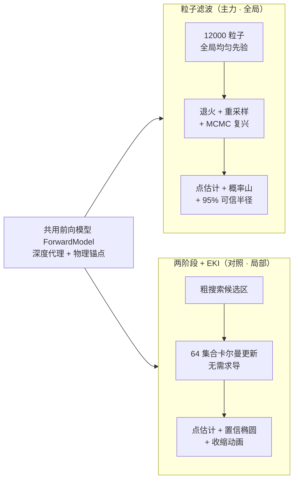

# 化工园区气体泄漏溯源算法 · 讲解稿

> 适用对象：评委 / 同行 / 老师。目标：听完能回答“源在哪、强度多大、有多大把握、凭什么这么算”。
> 配套代码：`code/chemical-main/algorithm/inversion/`（反演）、`deep_learning/gas_surrogate.py`（前向代理）、`diffusion/conditioned_advection.py`（物理锚点）。

---

## 〇、30 秒先讲清楚一件事

**溯源 = 解一道“反问题”。**

正问题是：已知泄漏源在哪、排多猛、刮什么风 → 算每个传感器该测到多少浓度。
反问题是：**只看到一堆传感器读数 + 风向风速 → 倒推泄漏源的位置 (x, y) 和排放强度 Q。**

整个算法就是围着“怎么把这道反问题解准、解稳、还能给出可信度”在做。记住这条主线，下面所有细节都挂得上。

---

## 一、先把“正问题”讲明白：前向模型 G(θ)（重点①）

反问题没法直接解，必须先有一个“正向预测器”。项目里它叫 **前向模型 `ForwardModel`**（`inversion/forward_model.py`）。

### 1.1 状态是什么

一个候选泄漏源用一个三维状态描述：

```
θ = [x_s, y_s, Q]
      │    │    └─ 排放速率（g/s），源有多猛
      │    └────── 源的 Y 坐标（地图像素）
      └─────────── 源的 X 坐标（地图像素）
```

### 1.2 前向算子干什么

`G(θ)` = 给定一个候选源 θ，预测每个传感器“本应该”测到的浓度（ppm）：

- `forward_model.py:210` `predict(x, y, Q)` → 返回 N 个传感器的浓度向量
- 上风向的传感器浓度**精确为 0**（烟羽只往下风方向走，这是强物理约束）

### 1.3 物理根基：深度学习代理 + 物理锚点（★最该强调的设计）

这是整个算法“可信”的根基，一定要讲：

- **教师模型（物理）**：`diffusion/conditioned_advection.py`，一个确定性的网格化平流–扩散模型。输入源、障碍、风、气体属性，输出浓度场。可检查、可复现，**不依赖外部黑箱 U-Net**（因为交付的 U-Net 绝对浓度未经过现场验证，项目明确弃用）。
- **学生模型（神经网络）**：`deep_learning/gas_surrogate.py`，一个 PyTorch MLP（12 维特征 → log ppm），由物理教师模型监督训练而成。
- **运行时融合**（`gas_surrogate.py:30`）：

  ```
  NEURAL_BLEND_WEIGHT = 0.03   →  97% 物理锚点 + 3% 神经残差校正
  ```

  也就是说，**神经网络只做 3% 的残差微调，物理模型占 97%**。神经网络永远不脱离物理，只是加速 + 小幅修正。
- **安全开关**（`gas_surrogate.py:36`）：当现场气象塔提供了“释放高度实测风速 / 湍流脉动”这些神经网络没见过的特征时，**自动退回纯物理锚点**，避免给一个本就更好的物理解加上未校准的神经残差。

> 讲点：这套“物理为主、神经为辅、按特征兼容性自动切换”的设计，是答辩里最能体现工程严谨性的地方。

### 1.4 一个被反复利用的关键性质：Q 是线性的

浓度对排放速率 Q 线性：

```
predict(x, y, Q) = predict_unit(x, y) × Q      # forward_model.py:221
```

`predict_unit` 是 Q=1 g/s 时的单位响应。这条线性性带来两个好处：

1. **向量化批量预测**（`forward_model.py:223` `predict_batch`）：一次算 [12000 粒子 × N 传感器]，没有 Python 循环，这是粒子滤波能在 CPU 上跑得动的关键。
2. **解析法拟合 Q**（`forward_model.py:259` `fit_emission_rate`）：位置定了之后，Q 不用搜，直接最小二乘闭式解：

   ```
   min_Q ‖Q·g − c‖²   →   Q = (g·c) / (g·g)
   ```

   g 是单位响应向量，c 是实测浓度向量。所以两条溯源路线**最后都补一步解析重拟合 Q**，比纯迭代估得更准。

---

## 二、主力方法：粒子滤波源项反演（重点②，全场最重点）

代码：`inversion/particle_filter.py`。当前正式溯源走的就是它（API `/api/inversion/particle-filter`）。

### 2.0 直觉类比

> 往地图上撒一把“候选源”（12000 个），每个都假设自己是真源。让前向模型算一遍“如果是你，传感器该读多少”，跟真实读数比对——**谁算出来的跟实测最像，谁权重就高**。一轮轮迭代，像不像的候选被淘汰、像的候选被复制+微调，最后这把候选源聚成的“一团”，就是泄漏源最可能在的地方。

### 2.1 状态空间与初始化（`particle_filter.py:478`）

- 位置 (x, y)：在地图边界内**均匀**撒
- 强度 Q：**对数均匀**撒（因为源强可能跨好几个数量级，线性均匀会让小源没样本）
- 默认 **12000 粒子**，权重均等

### 2.2 五步迭代主循环（`particle_filter.py:101`）

每一轮做以下五件事：

**① 算似然——量化“像不像”**（`_log_likelihood`, `particle_filter.py:487`）

每个粒子用前向模型预测 N 个传感器浓度，跟实测算残差，套高斯似然：

```
σ² = (传感器噪声×|实测|)² + (模型噪声×scale)² + 最小噪声²
log L = −0.5 Σ [ (残差/σ)² + ln(2πσ²) ]
```

噪声由“传感器测量误差 + 物理模型误差”两部分组成，谁大谁主导，合理。

**② 退火（Tempering）——防早熟**（`particle_filter.py:102`）

这是亮点。不是一上来就把似然全加上，而是让一个温度参数 β 从 0 平滑升到 1：

```
weights ← normalize( log(weights) + (β_next − β) × log L )
```

β=0 时纯先验（谁都有份），β=1 时纯似然（只看像不像）。慢慢加，避免第一轮就被少数几个高似然粒子垄断、其他全死掉。

**③ 重采样——淘汰与复制**（`particle_filter.py:107`, `_systematic_resample:594`）

用**有效样本数 ESS** 判断粒子多样性：

```
ESS = 1 / Σ wᵢ²        # 越小说明权重越集中在少数粒子上
```

当 `ESS < 0.55 × 12000` 时触发**系统重采样**：按权重复制高权重粒子、丢弃低权重粒子，重置权重均等。这是粒子滤波的“优胜劣汰”。

**④ MCMC 复兴（Rejuvenation）——防退化**（`_mcmc_rejuvenate`, `particle_filter.py:607`）

重采样有个老毛病：复制来复制去，粒子都长一样了（粒子退化）。解决办法：

- 给每个粒子加一点**高斯抖动**（位置加正态扰动，Q 乘对数正态扰动）
- 用 **Metropolis–Hastings** 接受/拒绝：抖动后更像就接受，更不像就以概率拒绝

```
log_accept = β × (新似然 − 旧似神);   ln(rand) < log_accept 则接受
```

这样既补回了多样性，又不会瞎抖到不合理的地方。**这一步是这套实现比“教科书粒子滤波”专业的地方。**

**⑤ 记录与收敛诊断**

每轮记点估计 (x, y, Q)、ESS、RMSE。最后还算 **split-R̂**（`particle_filter.py:443`）——把粒子分 4 链看各链均值是否一致，R̂≈1 说明收敛、结果稳定可重复。

### 2.3 亮点约束：到达时间 + 上风向（`_arrival_time_log_likelihood`, `particle_filter.py:530`）

光靠“浓度像不像”在弱风/少传感器时容易多解。项目加了两个物理约束增强定位：

- **到达时间**：每个传感器首次检测到气体的时间。预测到达时间 ≈ 沿风向距离 ÷ 输运风速。
  - **绝对到达时间**：约束源的绝对位置
  - **相对到达时间**：各传感器到达时间两两相减（减去最小值），消除“源什么时候开始漏”这个未知量——**只保留空间几何信息**，更稳
- **上风向信号约束**：源不该在上风向的传感器产生信号。如果某个粒子让上风向传感器也“有读数”，就狠狠扣分。

> 讲点：用“到达时间差”而不是“到达时间绝对值”，是个很聪明的去参量化技巧，值得专门点出来。

### 2.4 输出：不只是给一个点，而是给一片“概率山”（★可视化重点）

`run_particle_filter_inversion_task`（`particle_filter.py:165`）的输出有三层：

1. **点估计**：加权均值 → (x, y, Q)；再用解析法重拟合一次 Q
2. **不确定性**：加权协方差 → 95% 可信区间、可信半径（`covariance_to_radius`）
3. **概率地形 GeoJSON**（`build_particle_kde_geojson`, `particle_filter.py:280`）：
   - 把最终粒子做**加权高斯核密度估计 (KDE)**，插值成规则网格
   - 带宽 = 协方差 × Scott 因子 + 正则化（`_kde_bandwidth:404`）
   - 归一化密度映射成**高程 z**：`z = base + density^0.75 × scale`
   - 输出成 GeoJSON Polygon 网格，**前端把它当作唯一合法的概率地形输入**，渲染成三维“概率山”——山峰就是源最可能在的地方

> 讲点：别人家的溯源往往只给一个点；这里给的是一座“概率山”+ 95% 可信半径，**把不确定性可视化出来了**，这正是反问题该有的诚实表达。

### 2.5 误差闭环（`particle_filter.py:249`）

如果 payload 带了真源（验证场景），自动算：
- 位置误差（米）、源强误差（%）
- `matched = 位置误差 ≤ 15 m`（命中判据）

---

## 三、对比方法：两阶段解析反演 + EKI（重点③，作为对照讲）

代码：`inversion/source_inversion.py` + `inversion/eki.py`。API `/api/inversion/solve`。和粒子滤波**共用同一个前向模型**，区别在“怎么搜”。

### 3.1 EKI 是什么（`eki.py:16`）

**集合卡尔曼反演**（Ensemble Kalman Inversion, Iglesias 2013）。维护一个小集合（默认 64 个成员），不需要求导，用卡尔曼式更新把它们推向后验：

```
G_j   = G(θ_j)                              # 每个成员前向预测
θ_j  ← θ_j + C_tg (C_gg + αΓ)⁻¹ (y + ξ_j − G_j)
       │          │       │      └─ 观测扰动
       │          │       └─ 观测噪声协方差 × 自适应正则
       │          └─ 输出协方差
       └─ 交叉协方差(状态, 输出)
```

- 集合均值 = 点估计；集合协方差 = 定位不确定性（置信椭圆的来源）
- CPU 毫秒级（64 成员 × 几个传感器）

### 3.2 两阶段流程（`source_inversion.py:44`）

```
Stage 1  粗搜索 grid_search → 候选区域 → 按 loss+支持数+邻近度排名
Stage 2  对 top-K 候选用 EKI 精细化 → 选 finalLoss 最小的
         每轮 EKI 映射成一帧动画：均值→圆心，协方差椭圆→收缩的置信多边形
```

### 3.3 两种方法对比（讲给别人听时用这张表）

| 维度 | 粒子滤波（主力） | 两阶段 + EKI（对照） |
|---|---|---|
| 状态 | [x, y, Q] | [x, y, log Q] |
| 样本量 | 12000 粒子 | 64 集合成员 |
| 先验 | 全局均匀（不依赖候选） | 高斯，围绕粗搜索候选 |
| 核心机制 | 退火 + 重采样 + MCMC 复兴 | 卡尔曼式更新 |
| 额外约束 | 到达时间 + 上风向 | 数据 misfit |
| 搜索范围 | **全局** | **局部**（需先粗搜索） |
| 输出 | 点 + 95%CI + KDE 概率山 + R̂ | 点 + 置信椭圆 + 收缩动画 |
| 适用 | 未知源、全局搜索、要不确定性量化 | 已有候选区、要快、要动画 |

> 一句话总结：**EKI 是“知道大概在哪、再精修”；粒子滤波是“不知道在哪、全图撒网、边撒边收敛、还给你一座概率山”。** 项目把粒子滤波定为主力，正是因为化工泄漏场景下源位置事先未知、且必须给出可信度。

---

## 四、一条完整数据流（讲“怎么跑起来的”）

```
前端采集传感器浓度 + 风向风速 + 气体属性
        │  POST /api/inversion/particle-filter  (X-API-Key 鉴权)
        ▼
api_server.py:481  路由 → {task_type: run_particle_filter_inversion, payload}
        ▼
engine/task_router  分发
        ▼
inversion_runner.run_particle_filter_inversion_task
        ▼
particle_filter.run_particle_filter_inversion_task
   ├─ _extract_sensors        提取≥3个有效观测，去重、校验
   ├─ _config_from_payload    自动定 bounds（传感器包围盒扩展+裁到地图内）
   ├─ ForwardModel.from_scenario  构建前向算子（含深度代理+物理锚点）
   ├─ run_particle_filter     五步迭代主循环
   ├─ fit_emission_rate       解析重拟合 Q
   ├─ build_particle_kde_geojson  生成概率地形
   └─ errorMetrics            位置误差/源强误差/命中
        ▼
返回：estimatedSource + posterior + posteriorDensityGeoJSON + diagnostics + history
        ▼
前端渲染：源图标 + 95% 可信圆 + 三维概率山 + 迭代过程动画
```

---

## 五、讲解时最该强调的 5 个亮点（背下来）

1. **物理一致性**：深度学习只是 3% 残差，物理模型占 97%，且遇到未训练特征自动退回纯物理——**不是黑箱**。
2. **Q 线性 → 解析拟合 + 向量化**：让 12000 粒子在 CPU 跑得动，且强度估计有闭式解兜底。
3. **退火 + MCMC 复兴**：解决粒子滤波两大顽疾（早熟、退化），比教科书实现专业。
4. **到达时间差约束**：去参量化技巧，弱风/少传感器下也能定位，不靠绝对时间。
5. **概率山 + 95% 可信半径**：反问题诚实输出不确定性，可视化成三维地形，不只是给一个点。

---

## 六、Q&A 预案（别人可能会问的）

**Q1：神经网络会不会“胡编”浓度？**
不会。它只做 3% 残差，且只在训练见过的特征范围内启用；遇到实测气象（释放高度风速、湍流脉动）自动退回纯物理。物理模型始终是锚。

**Q2：12000 粒子为什么够？怎么保证可重复？**
默认种子 `seed=20250613`，全程确定性。验证脚本用 9000 粒子 × 24 轮、多随机种子做重复性检查，避免用过低预算掩盖种子不稳定（见 README）。

**Q3：为什么不用纯梯度优化？**
前向模型含神经网络 + 上风向硬截断，梯度不光滑；粒子滤波/EKI 都**不需要求导**，且天然给出不确定性。梯度法给不出“可信半径”。

**Q4：15 米命中判据怎么来的？**
`errorMetrics.matched = 位置误差 ≤ 15 m`（`particle_filter.py:252`），是项目定的验收阈值，配合 Prairie Grass 真实扩散宽度验证 + 合成观测验证。

**Q5：合成观测能当真实事故讲吗？**
不能。README 明确“合成观测不得写成真实事故数据”。真实数据只用于验证横风向扩散宽度 Sy，不扩展为绝对浓度或完整事故级模型验证。

**Q6：粒子滤波和 EKI 为什么都留着？**
互补。粒子滤波做全局搜索 + 不确定性；EKI 在已有候选区时更快且能驱动收缩动画。共用前向模型，保证两条路线物理自洽。

---

## 七、验证与可信度（收尾用）

- **真实数据**：Prairie Grass 真实扩散宽度验证（横风向 Sy），`algorithm.inversion.validate_prairie_grass_source_inversion`
- **合成验证**：`algorithm.inversion.validate_particle_filter`，覆盖定位、源强、噪声压力、多种子重复性
- **物理不变量**：`algorithm.diffusion.test_physical_invariants`（质量守恒、单调性等）

> 收尾话术：这套溯源不是“跑通就行”，而是物理有锚、数值有诊断、结果有不确定性、验证有真实数据托底——**可解释、可重复、可验收**。

---

## 附录 A：算法流程图（讲解时配合展示）

> 四张 Mermaid 图，分别对应「宏观数据流 / 前向模型内部 / 粒子滤波主循环 / 两方法对比」四个层次。已渲染为 PNG + SVG 文件，见 `flowcharts/` 目录，可直接插入 PPT。
> 渲染方式：VS Code 装 Markdown Preview Mermaid Support / Typora / Obsidian / [mermaid.live](https://mermaid.live) 粘贴即可预览，导出 PNG 用 `mmdc`（mermaid-cli）。

### 图 1 · 宏观数据流：从传感器读数到前端概率山



### 图 2 · 前向模型 G(θ) 内部（重点①：物理为主，神经为辅）



### 图 3 · 粒子滤波五步主循环（重点②：全场最重点）



### 图 4 · 两种溯源方法对比（讲对照时用）


